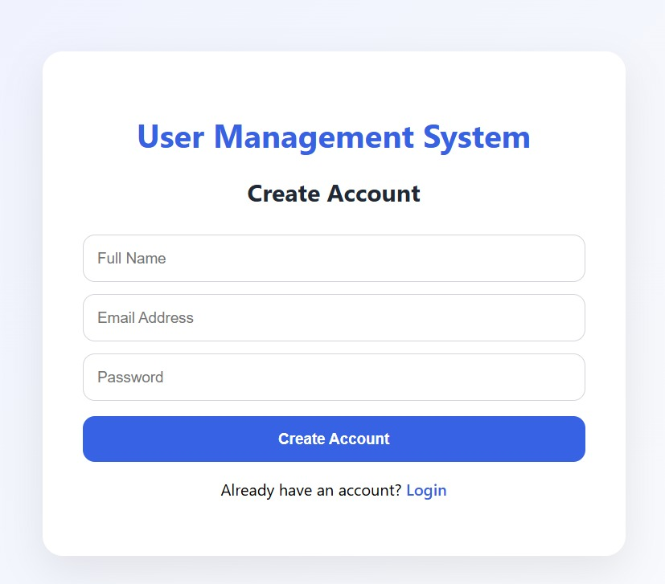
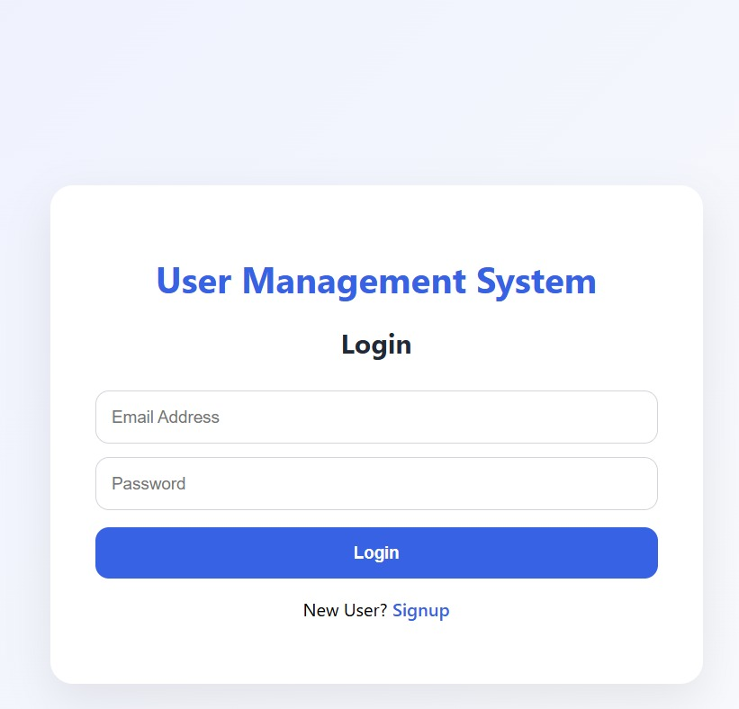
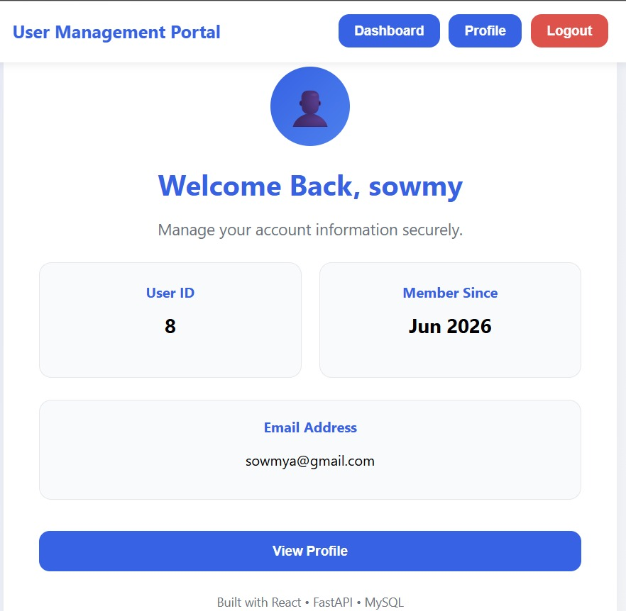
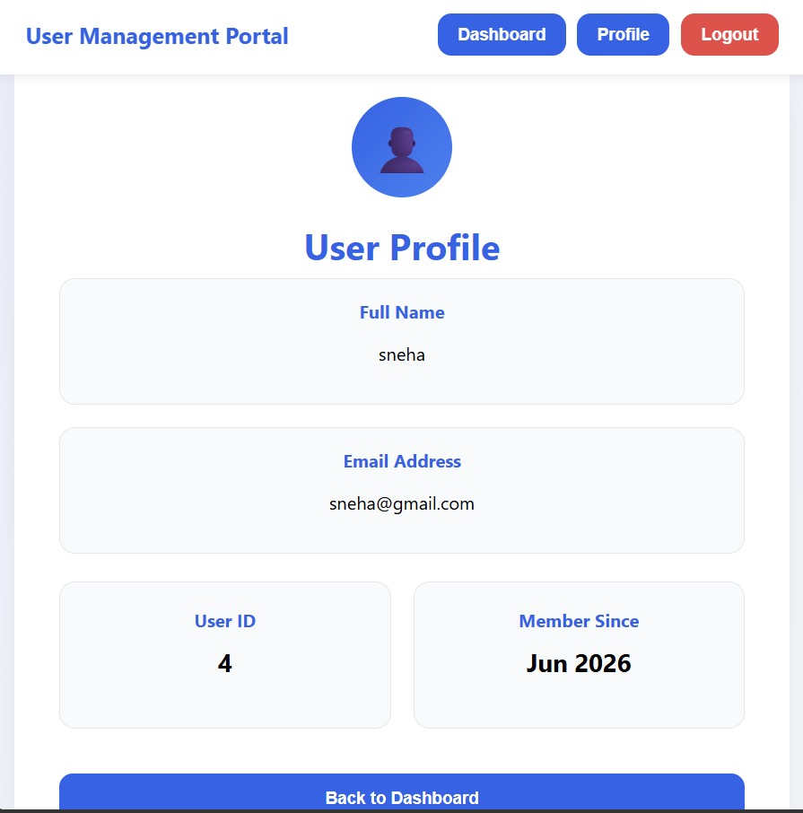

# User Management System

## Overview

A Full Stack User Management System built using React, FastAPI, and MySQL. The application provides secure user registration, login authentication, profile management, and dashboard functionality through a responsive and user-friendly interface.

---

## Features

* User Registration
* User Login Authentication
* Password Hashing using bcrypt
* User Profile Management
* Dashboard View
* Responsive UI
* MySQL Database Integration
* RESTful API Architecture
* Form Validation
* Error Handling

---

## Tech Stack

### Frontend

* React.js
* React Router DOM
* Axios
* Vite
* CSS3

### Backend

* FastAPI
* SQLAlchemy ORM
* Pydantic
* Uvicorn

### Database

* MySQL

### Authentication & Security

* Password Hashing using bcrypt
* Secure Password Storage
* Input Validation
* Error Handling

---

## Project Structure

```text
UserManagementSystem/

├── backend/
│   ├── main.py
│   ├── models.py
│   ├── database.py
│   ├── auth.py
│   ├── schemas.py
│   ├── login_schema.py
│   └── requirements.txt
│
├── frontend/
│   ├── src/
│   ├── package.json
│   └── vite.config.js
│
├── screenshots/
│   ├── signup.jpeg
│   ├── login.jpeg
│   ├── dashboard.jpeg
│   └── profile.jpeg
│
└── README.md
```

---

## Installation

### Backend Setup

```bash
cd backend

pip install -r requirements.txt

uvicorn main:app --reload
```

Backend Server:

```text
http://127.0.0.1:8000
```

### Frontend Setup

```bash
cd frontend

npm install

npm run dev
```

Frontend Server:

```text
http://localhost:5173
```

---

## API Endpoints

### User Registration

```http
POST /signup
```

Request:

```json
{
  "name": "Rakshitha",
  "email": "rakshitha@gmail.com",
  "password": "123456"
}
```

### User Login

```http
POST /login
```

Request:

```json
{
  "email": "rakshitha@gmail.com",
  "password": "123456"
}
```

### Fetch User Profile

```http
GET /profile/{email}
```

---

## Database Schema

### Users Table

| Field        | Type    |
| ------------ | ------- |
| id           | Integer |
| name         | String  |
| email        | String  |
| password     | String  |
| member_since | String  |

---

## Security Features

* Password Hashing using bcrypt
* Secure Password Storage
* Input Validation
* Error Handling
* Form Validation

---

## Application Screenshots

### Signup Page



### Login Page



### Dashboard



### Profile Page



---

## Assumptions

* Each user account is uniquely identified using an email address.
* Passwords must contain at least 6 characters.
* The application is intended for demonstration purposes and uses a local MySQL database.
* User profile information is accessible after successful login.
* The Member Since field stores the account creation period.

---

## AI-Assisted Development

This project was developed using AI-assisted development practices to accelerate implementation and improve productivity.

AI assistance was utilized for:

* Generating initial code structures
* Backend API development
* Frontend component creation
* Authentication workflow implementation
* Database integration
* Debugging and troubleshooting
* UI enhancements
* Documentation preparation

All generated suggestions were reviewed, tested, modified, and integrated manually to ensure correctness and compliance with project requirements.

---

## Challenges Encountered

During development, the following challenges were encountered:

1. Integrating the React frontend with the FastAPI backend and ensuring proper API communication.
2. Configuring MySQL connectivity and managing user data using SQLAlchemy ORM.
3. Implementing secure password hashing using bcrypt.
4. Managing user sessions and frontend route protection.
5. Designing a clean and responsive user interface while maintaining a scalable project structure.

These challenges were resolved through testing, debugging, documentation review, and iterative improvements.

---

## Future Enhancements

* Complete JWT-Protected Backend Routes
* Password Reset Functionality
* Email Verification
* User Roles and Permissions
* Admin Dashboard
* Account Deactivation
* Profile Image Upload

---

## Conclusion

The User Management System successfully implements user registration, login, profile management, secure password storage, and MySQL database integration. The project demonstrates full-stack development skills including frontend development, backend API design, database management, authentication, and responsive UI development.

---

## Author

Rakshitha C

RV Institute of Technology and Management

Bangalore, India
